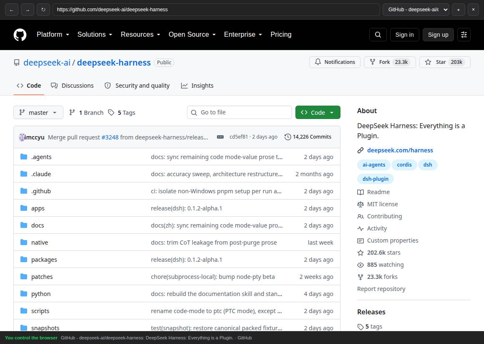

# DeepSeek Harness Browser Use

Persistent Playwright browser tools and an interactive browser panel for [DeepSeek Harness](https://github.com/deepseek-ai/deepseek-harness).

The plugin keeps one Chromium profile across turns, shares login state between tabs, lets agents operate pages through stable snapshot references, and provides a live browser view where a human can watch without interrupting the agent or explicitly take control when needed.

<p align="center">
  
</p>

## Requirements

- DeepSeek Harness `0.1.5-rc.2` (the dependencies and development fixtures target this exact release).
- Node.js 22 or newer.
- pnpm available to the `dsh plugin` command.
- A Chromium or Chrome executable on the Host machine.
- A model that accepts image input if `browser_screenshot` is used.

The package depends on `playwright-core`; it does not download a browser automatically.

The panel registers authenticated POST routes under `/api/browser-use/` through
`connection.fetch`. It uses the standard DSH browser session and Origin checks,
forwards request cancellation to Playwright, and removes its routes when the
plugin unloads. No changes to the core plugins or profile injection overrides
are required. This checkout replaces the older `/browser-use` RPC transport;
rebuild it and refresh the DSH page after upgrading.

## Install

Install from npm into the profile that runs DSH Web:

```bash
dsh plugin --profile web add @syncended/dsh-browser-use
```

Or install a local checkout while developing:

```bash
git clone https://github.com/syncended/deepseek-harness-browser-use.git
cd deepseek-harness-browser-use
pnpm install
pnpm check
dsh plugin --profile web add -w "$PWD"
```

Restart the existing DSH Host after installation:

```bash
dsh --profile web --no-open
```

Do not start a second Host for the same profile. Refresh DSH Web after the Host is ready.

## Connect and use

1. Open or create a DSH session.
2. Open the **Browser** tab in the conversation details pane.
3. Keep the panel open to watch the agent browse in real time; passive viewing does not block agent actions.
4. Select **Take control** at the bottom only when you need to interact manually, then select **Return control to agent** when finished.
5. Enter an HTTP or HTTPS address in the toolbar while you have control, or ask the agent to navigate. The same tabs and profile remain available on later turns.

Login state is shared by all tabs in the configured browser profile. The durable profile is stored under the DSH home directory, not in this repository.

## Agent tools

- `browser_status` — inspect process state, control owner, and tabs.
- `browser_tabs` — list, create, select, or close tabs.
- `browser_navigate` — navigate the active tab.
- `browser_snapshot` — receive visible interactive elements with one-shot references.
- `browser_click` — click a reference from the latest snapshot.
- `browser_type` — replace the value of a text field.
- `browser_press` — send a Playwright key or shortcut.
- `browser_scroll` — scroll by pixel deltas.
- `browser_screenshot` — capture the active viewport as an image attachment.

Take a fresh `browser_snapshot` after every click, type, key press, navigation, or scroll. Old snapshot references are intentionally rejected.

Password, payment, and one-time-code fields require human control and cannot be filled through `browser_type`.

## Configuration

The package adds this default Host entry through `cordis.patch.yml`:

```yaml
- id: browser-use
  name: '@syncended/dsh-browser-use'
  config:
    profile: default
    headless: true
    noSandbox: false
    viewportWidth: 1280
    viewportHeight: 800
    screenshotQuality: 70
    operationTimeoutMs: 20000
    humanLeaseTtlMs: 15000
```

Override only the required values in the profile's `cordis.patch.yml`. Useful options include:

| Option | Purpose |
| --- | --- |
| `profile` | Durable browser-profile name. |
| `headless` | Run Chromium without a desktop window. |
| `executablePath` | Use a specific Chromium or Chrome binary. |
| `noSandbox` | Add Chromium's `--no-sandbox` flag. |
| `viewportWidth`, `viewportHeight` | Default page viewport. |
| `screenshotQuality` | JPEG quality from 1 to 100. |
| `operationTimeoutMs` | Navigation and action timeout. |
| `humanLeaseTtlMs` | Time before an inactive human-control lease expires. |

Restart the Host after changing Host configuration.

## Security

- Browser profiles can contain authenticated sessions. Protect the DSH home directory as credential material.
- Remote Web control follows the Host's DSH `trustedHosts` policy. Do not expose DSH Web to untrusted networks.
- Keep Chromium's sandbox enabled. Set `noSandbox: true` only inside an appropriately isolated container where Chromium runs as root.
- Passive Browser-panel viewing does not acquire control. Explicit human control blocks agent actions until the lease is released or expires.
- Use a separate `profile` for untrusted browsing or separate identities.

## Troubleshooting

### Chromium does not start

Install Chromium or Chrome on the Host and set `executablePath` to its absolute path. On Linux, also verify that the browser's shared-library dependencies are installed.

### The Browser tab is missing

Confirm that the package is installed in the profile serving DSH Web, restart that Host, and refresh the page.

### An action says that human control is active

Release control in the Browser panel or wait for `humanLeaseTtlMs` to expire.

### A click or type reference is rejected

Call `browser_snapshot` again. References are valid only for the page state that produced them.

### A site blocks headless Chromium

This plugin does not attempt to bypass anti-bot controls. Use the site's supported API or complete the operation manually where permitted.

## Update and remove

```bash
dsh plugin --profile web add @syncended/dsh-browser-use@latest
dsh plugin --profile web remove @syncended/dsh-browser-use
```

Restart the Host after either command.

## Development

```bash
pnpm install
pnpm check
npm pack --dry-run
```

## License

MIT
