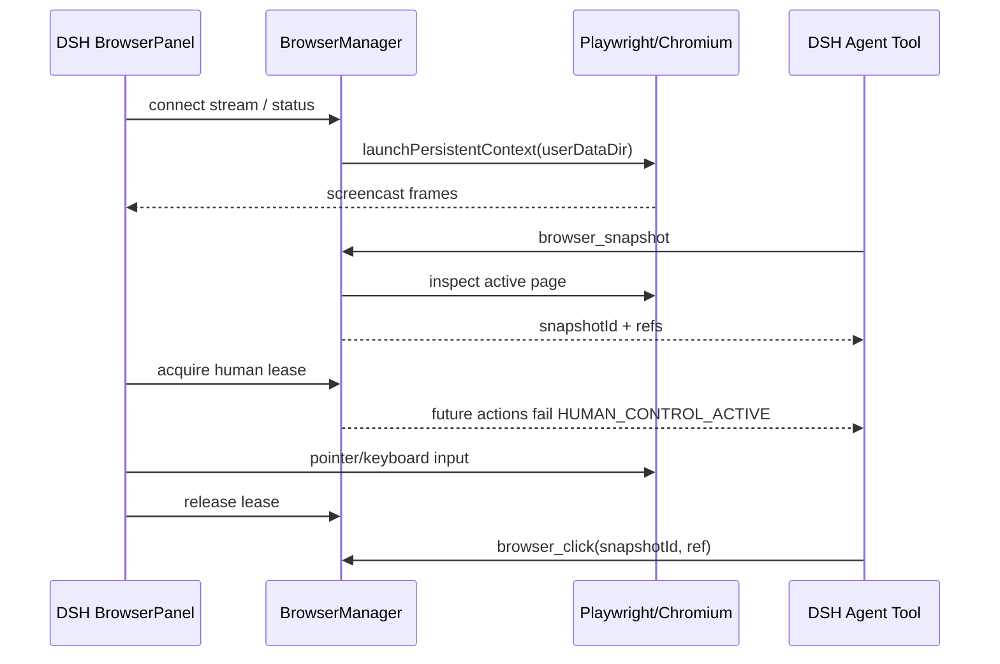

# Архитектура persistent browser use для DeepSeek Harness

Статус: **proposal**  
Проверенная версия DSH: **0.1.1-rc.2**

## 1. Цель

Плагин должен дать агенту и человеку один и тот же полноценный браузер:

1. агент управляет страницами через типизированные DSH tools;
2. человек видит живой viewport рядом с чатом и может взять управление для логина, MFA или CAPTCHA;
3. cookies, local/session storage, IndexedDB, permissions и история вкладок не исчезают при перезапуске DSH;
4. браузерная автоматизация не зависит от DOM страницы DSH и не пытается встраивать сайты через `iframe`;
5. ввод паролей человеком не попадает в session log или контекст модели.

## 2. Ключевые решения

| Область | Решение | Почему |
|---|---|---|
| Automation | Playwright | устойчивые locators, ожидания, popup/download/file chooser, хороший TypeScript API |
| Browser MVP | Chromium | CDP даёт эффективный `Page.startScreencast`; один предсказуемый runtime |
| Профиль | `launchPersistentContext(userDataDir)` | нативная долговечность cookies, storage, permissions и browser cache |
| Отображение | CDP JPEG screencast → WebSocket → canvas | обычный `iframe` блокируется CSP/X-Frame-Options и не разделяет Playwright context |
| UI | dock справа от conversation | браузер остаётся виден одновременно с чатом |
| Координация | exclusive control lease | агент и человек не должны одновременно кликать/печатать |
| Команды UI | trusted DSH Connection RPC; отдельный WS только для frames/input | штатный Host/Origin fence для state/control и низкая задержка media/input |
| Agent API | `ctx.tools.register(defineTool(...))` | штатный DSH tool registry, policies, cancellation и Code Mode |

Puppeteer не даёт преимуществ для этого MVP: Chromium всё равно нужен, а Playwright лучше покрывает пользовательские сценарии, ожидания, frames, downloads и browser contexts.

## 3. Что реально предоставляет DSH

Исследование установленного DSH 0.1.1-rc.2 показывает следующие точки интеграции.

### Host и tools

- `@deepseek-ai/dsh-tools`: `ctx.tools.register()` и `defineTool()`; поддерживаются typed output, cancellation, policy pipeline и tool-owned UI presentation.
- `@deepseek-ai/dsh-host-webserver`: `ctx.webServer.register()` и `registerUpgrade()` для HTTP и WebSocket routes.
- `@deepseek-ai/dsh-home-paths`: `dshHomePath(...)` для пользовательских данных под единым `$DSH_HOME`.
- Cordis lifecycle даёт детерминированный dispose: при остановке DSH закрываем context/process, но не удаляем профиль.

### Client plugin

Пакет с `exports["./client"]` и манифестом `dsh.client` автоматически попадает в `window.__DSH_BOOT__`, собирается и загружается Web client module loader. Клиент регистрирует React surface через DSH slot system.

Публикуемый `./client` обязан быть собран в lazy-CJS registration format DSH (`window.__ModuleLoader__.load({ id, factory })`), а React/Cordis/UI dependencies должны быть externalized согласно module graph. Это отдельный build spike: установленный npm release не публикует исходный `tsdown.client.ts` preset как готовый внешний API. HMR receiver сам ничего не компилирует — изменения появляются только пока watcher реально пересобирает client bundle.

### Ограничение текущего layout

`@deepseek-ai/dsh-client-ui-layout` сейчас владеет фиксированным трёхколоночным `AppFrame`: `sidebar`, `conversation`, `details`. `details` — single slot, уже занятый `ui-conversation`, имеет ширину 300–520 px и предназначен для деталей tool call. Замена этого occupant сломает существующую панель.

Поэтому полноценный dock требует маленького расширения DSH layout contract. Без него безопасный fallback — отдельный entry в `conversation.view`, то есть Browser как вкладка вместо side-by-side режима.

## 4. Состав плагина

Предлагается один npm-пакет `@syncended/dsh-browser-use`, который одновременно является installable profile bundle и имеет две runtime faces.

```text
@syncended/dsh-browser-use
├── package root (Node/Host)
│   ├── BrowserManager
│   ├── BrowserProfileStore
│   ├── BrowserControlArbiter
│   ├── BrowserToolSuite
│   ├── BrowserRpcApi
│   └── BrowserStreamGateway
├── ./client (Web)
│   ├── BrowserDock registration
│   ├── BrowserPanel
│   ├── BrowserStreamClient
│   └── input/toolbar/tab controls
└── cordis.patch.yml
```

Ориентировочный package manifest:

```json
{
  "exports": {
    ".": "./lib/index.js",
    "./client": "./lib/client.js",
    "./cordis.patch.yml": "./cordis.patch.yml"
  },
  "dsh": {
    "bundle": { "patch": "./cordis.patch.yml" },
    "client": {
      "inject": [
        "@deepseek-ai/dsh-client-connection",
        "@deepseek-ai/dsh-client-runtime",
        "@deepseek-ai/dsh-client-ui-layout"
      ],
      "platform": "web"
    }
  }
}
```

`dsh plugin --profile web add @syncended/dsh-browser-use` добавляет bundle в `dsh.profile.bundles`. Его patch вставляет одну Cordis row:

```yaml
- insert:
    - id: browser-use
      name: '@syncended/dsh-browser-use'
      config:
        profile: default
        headless: true
        viewport:
          width: 1440
          height: 900
```

Profile-level `cordis.patch.yml` остаётся последним пользовательским override. Пакет должен использовать только public package exports, не `lib/*` internals DSH.

## 5. Host runtime

### 5.1 BrowserManager

`BrowserManager` — единственный владелец Playwright context и страниц.

Состояния:

```text
stopped → starting → ready → stopping → stopped
                ↘ failed
```

Требования:

- lazy start при первом открытии панели или tool call;
- single-flight start, чтобы UI и агент не запустили два Chromium;
- один persistent context на named profile;
- exclusive ownership lock: второй процесс DSH не может открыть тот же `userDataDir` и получает понятную ошибку;
- корректная обработка popup/new page/close/crash;
- graceful shutdown с сохранением tab manifest;
- очистка in-memory element refs при navigation/page close;
- все публичные операции принимают `AbortSignal`.

Браузерный **процесс** живёт вместе с процессом DSH. Браузерный **профиль** долговечен. После нового запуска DSH Chromium открывается с тем же `userDataDir`, а вкладки восстанавливаются из manifest. Отдельный вечный daemon в MVP не нужен: он усложняет обновления, locks, ownership и shutdown.

### 5.2 Данные на диске

```text
$DSH_HOME/browser-use/
├── profiles/default/
│   ├── user-data/          # Chromium profile, mode 0700
│   ├── tabs.json           # versioned, atomic replace
│   └── preferences.json
└── downloads/
    └── <profile>/
```

`tabs.json` хранит только `pageId`, URL, порядок, active tab и viewport metadata. Cookies и site storage остаются в нативном Chromium profile. Пароли и cookies никогда не экспортируются в JSON плагина.

Default profile глобален для одного `$DSH_HOME`: разные DSH sessions разделяют логины, как вкладки одного обычного браузера. При этом каждая agent session имеет свой active `pageId`. Позже можно добавить named profiles и per-workspace policy.

### 5.3 BrowserControlArbiter

Режимы:

- `agent`: tools могут действовать;
- `human`: UI владеет exclusive lease, новые mutating tools получают `HUMAN_CONTROL_ACTIVE`;
- `transition`: короткая фаза передачи, текущая операция abort/drain.

Lease содержит `ownerClientId`, `acquiredAt`, heartbeat и TTL. При закрытии вкладки DSH или потере WebSocket lease автоматически освобождается. Read-only `browser_status` и screenshot разрешены всегда; действия, navigation и typing — только владельцу текущего режима.

UI показывает явный индикатор **Agent control / You control**. Агент может попросить пользователя войти, но не получает текст из password fields.

## 6. Agent tools

MVP API должен быть небольшим, composable и безопасным:

| Tool | Назначение |
|---|---|
| `browser_status` | process/profile/control state, tabs, active page |
| `browser_tabs` | list/new/select/close |
| `browser_navigate` | URL + wait policy |
| `browser_snapshot` | compact accessibility/interactive tree с ephemeral refs |
| `browser_click` | click по ref из последнего snapshot |
| `browser_type` | fill/type по ref; password fields запрещены для агента |
| `browser_key` | press shortcuts/Enter/Escape |
| `browser_scroll` | scroll viewport/element |
| `browser_wait` | ожидание URL/text/load/network quiet с timeout |
| `browser_screenshot` | viewport/full-page image |

Можно позднее добавить select/drag/upload/download/evaluate. `browser_evaluate` по умолчанию не нужен: он увеличивает поверхность атак и позволяет обойти более узкие policies.

### Snapshot refs

Каждый `browser_snapshot` создаёт `snapshotId` и новый набор ссылок `e1`, `e2`, … на Playwright `ElementHandle`/frame context. Любая navigation или новый snapshot инвалидирует старый набор. Action обязан передать `snapshotId`; stale ref завершается ошибкой `STALE_BROWSER_SNAPSHOT`, а не пытается угадать элемент.

Snapshot содержит role, accessible name, value/checked state, bounds и краткий text. Для `input[type=password]` value всегда редактируется. Full HTML, cookies, localStorage и hidden DOM не возвращаются.

### Tool results и session log

В durable tool result попадают только:

- URL/title/page id;
- результат действия;
- компактный snapshot или screenshot;
- безопасная ошибка.

Raw keystrokes человека, WebSocket frames, cookies, authorization headers и CDP payloads не логируются. Tool bodies соблюдают `exec.signal`; timeout реализуется штатной DSH timeout policy.

## 7. Viewport и protocol

### 7.1 Почему не iframe

Встраивание target URL в DSH page не работает как универсальный browser use:

- сайты запрещают embedding через CSP и `X-Frame-Options`;
- iframe использует browser profile пользователя, а не Playwright context;
- cross-origin DOM недоступен;
- невозможно гарантированно синхронизировать действия агента и человека.

Поэтому UI — remote viewport того Chromium, которым владеет Host.

### 7.2 Control plane

State, tabs, navigation, lease acquisition и toolbar commands идут через штатный DSH Connection RPC:

- Host: `ctx.connection.rpc.handle('browser-use', handler, { authority: 'loopback' })`;
- Client: `ctx.connection.rpc.call('browser-use', endpoint, payload, signal)`;
- каждый payload валидируется на Host, browser-side `isLoopback` не считается авторизацией.

Это повторно использует `/api` Host/Origin/DNS-rebinding fence. Если browser domain станет first-party частью DSH, этот channel следует заменить generated Typert service (`ctx.remote.browser.*`) без изменения BrowserManager.

### 7.3 Screencast

Для active page Host создаёт CDP session и включает:

```text
Page.startScreencast(format=jpeg, quality≈70, maxWidth, maxHeight, everyNthFrame=1)
```

Frame pipeline:

1. Chromium отдаёт JPEG + sessionId;
2. gateway оставляет не более одного pending frame на client;
3. frame отправляется бинарным WebSocket message с `pageId`, sequence и dimensions;
4. client декодирует через `createImageBitmap` и рисует в `<canvas>`;
5. gateway ack-ает CDP frame; при backpressure промежуточные кадры выбрасываются, а не накапливаются.

Цель MVP: 8–15 FPS при активной странице, quality 65–75, adaptive resize. Когда dock скрыт, screencast выключается; Playwright context продолжает жить.

### 7.4 Input

По тому же WebSocket client отправляет versioned low-latency messages:

```ts
{ type: 'pointer', kind: 'down' | 'up' | 'move', x, y, button, modifiers }
{ type: 'wheel', deltaX, deltaY, x, y }
{ type: 'key', kind: 'down' | 'up', key, code, text?, modifiers }
{ type: 'viewport', width, height, deviceScaleFactor }
{ type: 'lease-heartbeat' }
```

Acquire/release lease остаются RPC-командами; WebSocket heartbeat только поддерживает уже выданный lease. Coordinates переводятся из CSS size canvas в browser viewport. IME и clipboard требуют отдельного protocol сообщения и тестов; простой латинский/Unicode text input входит в MVP.

### 7.5 Trust boundary

Custom WebSocket доступен только той же локальной Web surface:

- короткоживущий одноразовый nonce выдаётся через trusted Connection RPC;
- Host header должен быть loopback authority;
- `Origin`, если присутствует, обязан совпадать с Host;
- cross-site Fetch Metadata отклоняется;
- origin/host validation должна использовать тот же алгоритм, что `/api` fence DSH.

Лучшее upstream-решение — экспортировать reusable trusted-request guard из `dsh-client-connection` либо дать плагинам регистрировать trusted upgrade endpoints под API carrier. До этого plugin package не должен заявлять поддержку `0.0.0.0`: у DSH Web нет authentication layer.

## 8. Изменение DSH layout

### Предлагаемый contract

Расширить `@deepseek-ai/dsh-client-ui-layout` generic dock seam:

```ts
interface ILayout {
  openDock(id: string): void
  closeDock(id?: string): void
  toggleDock(id: string): void
}

declare module '@deepseek-ai/dsh-client-ui-slots' {
  interface SlotMap {
    'shell.dock': {
      kind: 'list'
      scope: 'root'
      owner: { active: boolean; width: number }
    }
  }
}
```

Физически AppFrame остаётся трёхколоночным: `sidebar | conversation | right`. Когда активен named dock, правая колонка показывает выбранный `shell.dock` entry; вызов `openDetails()` возвращает штатный `details` occupant. Таким образом browser не shadow-ит single slot и tool details остаются доступны.

Dock:

- root-scoped, потому что browser profile не принадлежит одному chat session;
- взаимно исключается с details в одной правой колонке, а не создаёт четвёртую тесную колонку;
- resizable, рекомендуемый диапазон 480–1200 px, с отдельной width preference;
- может быть открыт кнопкой в session header и глобальным shortcut;
- не размонтирует BrowserPanel при переключении DSH session;
- при узком viewport переходит в full-width overlay или Browser view tab.

Нельзя напрямую регистрироваться в текущий `details`: это single slot, его owner session-scoped, а существующий occupant отвечает за tool details.

### Совместимый fallback

Пока DSH не имеет dock seam, client plugin регистрирует `conversation.view` с label `Browser`. Возможности Host/tools/persistence при этом полностью работают, но пользователь переключается между Chat и Browser.

## 9. Lifecycle



При shutdown:

1. перестать принимать новые actions;
2. abort/drain tool operations;
3. сохранить tabs manifest атомарно;
4. остановить screencast и WebSockets;
5. `context.close()`;
6. оставить `user-data` нетронутым.

## 10. Security и privacy

Browser use фактически даёт агенту доступ к авторизованным сайтам пользователя. Это не обычный read-only web fetch.

Обязательные меры:

- profile directory `0700`, файлы `0600` где применимо;
- явный UI status, когда агент управляет браузером;
- human takeover с exclusive lease;
- password fields никогда не доступны через `browser_type` и snapshots;
- cookies/storage/CDP Network bodies не являются tool outputs;
- uploads только из разрешённой filesystem policy/workspace;
- downloads помещаются в отдельный managed directory и возвращаются как paths;
- domain allow/deny policy и approval hook для потенциально опасных действий;
- запрет remote bind до появления authentication;
- optional audit metadata: tool, pageId, origin, result — без typed values и response bodies.

Важно: после входа агент по назначению видит содержимое страницы, доступное залогиненному пользователю. Human takeover защищает секрет во время ввода, но не скрывает последующее содержимое аккаунта.

## 11. Config proposal

```ts
interface BrowserUseConfig {
  enabled?: boolean
  profile?: string
  userDataDir?: string
  executablePath?: string
  channel?: 'chromium' | 'chrome' | 'msedge'
  headless?: boolean
  viewport?: { width: number; height: number }
  screencast?: { quality: number; maxFps: number }
  downloadsDir?: string
  restoreTabs?: boolean
  allowedOrigins?: string[]
  deniedOrigins?: string[]
  humanLeaseTtlMs?: number
}
```

Defaults должны ссылаться на `$DSH_HOME`, а не на workspace. `userDataDir` вне `$DSH_HOME` — advanced option с явной диагностикой.

## 12. Packaging Chromium

Рекомендуемый MVP:

- runtime dependency `playwright-core`;
- явная установка совместимого Chromium через plugin setup command/README;
- startup preflight с понятной командой исправления;
- `executablePath`/`channel` для системного Chrome.

Причина: pnpm deployments могут запрещать install scripts, поэтому нельзя молча полагаться на postinstall download. После проверки distribution path можно перейти на pinned Playwright browser package.

## 13. Нефункциональные критерии MVP

- повторный запуск DSH сохраняет login и восстанавливает tabs;
- открытие панели до первого tool call и первый tool call до открытия панели одинаково запускают один context;
- UI и agent наблюдают один page id и один viewport;
- popup OAuth появляется новой вкладкой и доступен в tab strip;
- human takeover блокирует agent mutation не позднее следующей операции;
- password input не появляется в logs даже при debug mode;
- hidden panel не генерирует screencast traffic;
- disconnect UI не закрывает context;
- crash Chromium даёт recoverable state и не удаляет profile;
- dispose DSH не оставляет дочерний Chromium process.

## 14. Отложенные возможности

- Firefox/WebKit viewport backend;
- отдельные named profiles в UI;
- video recording/HAR;
- extensions и passkeys/WebAuthn;
- mobile emulation;
- visual grounding по координатам;
- always-on browser daemon вне процесса DSH;
- remote multi-user deployment с authentication и per-user profiles.
